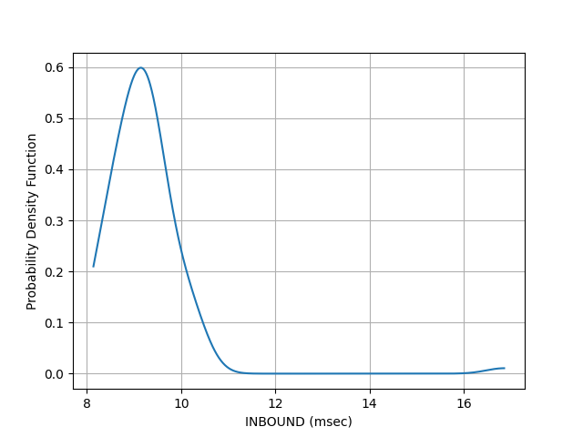

# TWAMP-5G-Firecell
This project aim to find the latency results using Firecell's 5G Labkit 40

## Step 1

Acccess the AWS TWAMP intant as per following steps

1. Got to www.amazon.com
2. Go to "Sign In to the Console" and enter the user name and password
3. Go to SERVICES-->COMPUTE--->EC2
4. Under "Resources" click on "instances"
5. Click on the INSTANT ID against name "TWAMP" ----> Connect---> Connect
6. Go to twamp directory

   ```sh
   ls
   ```
   
   and then 
   
   ```sh
   cd python
   ```   


## Step 2: Run the command at AWS

List the software and packages required to run the code in this repository, remember to use the private IP of AWS server for responder. For example:

   ```sh
   sudo python3 twampy.py responder 172.31.19.82:863
   ```

## Step 3: Run the command at sender

Run the following command.

   ```sh
   sudo python3 27runtwamp.py
   ```

## Step 4

After step 3 the script will save the CDF and PDF plot of the RTT, Inbound(incoming), outbound (outgoing) delays in msec in the folder "Results", and CSV file with name "TWAMP_timestamp.csv" in the same directory.
        
## Step 5

Repeat step 3 multiple time to collect the data for multiple scenarios.


## Contributing

We welcome contributions from the community. To contribute:

- Fork the repository.
- Create a new branch with a descriptive name.
- Make your changes and test them thoroughly.
- Submit a pull request with a detailed description of your changes.

## Result




